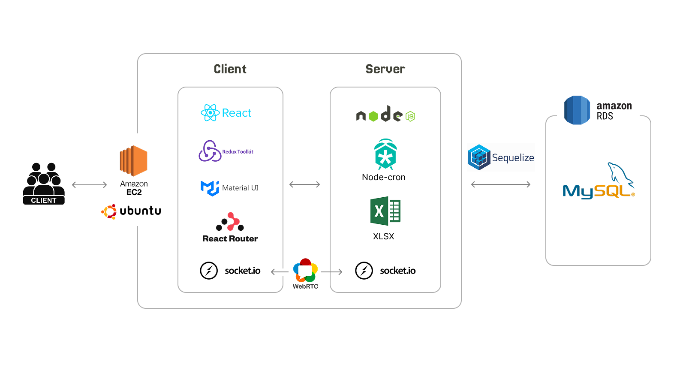

# LikeIt!
 *LikeIt - Frontend Repository*
 
 ### 프로젝트 소개
 이젠 아카데미 풀스택개발 수업 졸업작품인 **LikeIt!** 의 프론트엔드 리포지토리입니다. 창작자를 위한 클라우드 펀딩 플랫폼을 구현해보았습니다.
 
 ### 개발 기간
2025년 01월 17일부터 2025년 03월 06일까지
 
 ### 개발자 소개
 - **박별** : 사이트 전체 레이아웃, 스튜디오 포트폴리오,스페이스 기능, 새 프로젝트 페이지
 - **김인우** : 메인 화면, 펀딩 목록 페이지, 펀딩 상세 페이지, 후원 기능, 관리자 기능, 후원 통계, cron 스케줄링 시스템
 - **조나은** : 스튜디오 메인, 대표자 페이지, 커뮤니티 페이지, 창작자 화면
 - **박세빈** : 회원가입(카카오, 구글 연동), 로그인, 로그아웃, 아이디, 비밀번호 찾기, 마이페이지  
 
 ### 개발환경
 - OS: Windows 10
 - 실행 환경: Node.js v22.11.0
 - 개발 도구: VS Code, Git & GitHub
 - 데이터베이스: MySQL v8.0.40
  
 ### 기술스택
 - **Front-end:** React v19.0.0
   - `@mui/icons-material`(스타일링)
   - `@reduxjs/toolkit` (Redux 상태 관리)
   - `react-router-dom` (클라이언트 사이드 라우팅)
   - `socket.io-client` (WebSocket 기반 실시간 통신)
   - `axios` (HTTP 요청)
   - `date-fns`, `dayjs` (날짜 및 시간 관리)
 - **Back-end:** Node.js v22.11.0
   - `express` (웹 프레임워크)
   - `jsonwebtoken (JWT)` (토큰 기반 인증)
   - `passport`, `passport-google-oauth20`, `passport-kakao`, `passport-local` (OAuth 및 로컬 인증)
   - `mysql2` (MySQL 연결)
   - `sequelize` (MySQL ORM)
   - `socket.io` (WebSocket 기반 실시간 통신)
   - `node-cron` (스케줄링 작업)
   - `dotenv` (환경 변수 로드)
- **DB :** Mysql v8.0.40
- **Deploy:**
    - AWS: React 프론트 + Node.js 백엔드 배포(EC2 Ubuntu 리눅스), MySQL(RDS)

### 프로젝트 아키텍쳐

  
### 주요기능
- **창작자 스튜디오 개설** : 회원가입 후 마이페이지에서 창작자 정보를 등록하면 사용자 메뉴에서 '스튜디오'항목이 활성화된다. 직접 스튜디오를 생성하거나, 기존의 스튜디오에 소속될 수 있다. 스튜디오에는 해당 팀(혹은 개인)의 활동내역을 간단한 포트폴리오 형식으로 출력한다. 스튜디오의 대표는 멤버의 활동 권한(커뮤니티 글 작성, 음성스페이스 사용)을 수정할 수 있다.
- **펀딩 프로젝트 등록** : 새 프로젝트를 작성할 수 있는 입력 폼. 펀딩 프로젝트 하나를 기획할때 작성해야할 정보가 많기 때문에 프로젝트 명만 입력해서 DB에 데이터를 생성하고, 내용을 자유롭게 수정하는 형식으로 구현했다. 창작자가 폼 작성을 마치고 승인 요청을 보내면 에디터가 내용을 검토하고 프로젝트 상태를 변경할 수 있다.
- **음성스페이스** : 창작자와 후원자(구독자)의 소통을 도모하기 위한 음성 스페이스 기능. 소켓과 WebRTC를 통해 구현했다. 스튜디오에 접속한 유저는 해당 스튜디오 아이디로 네이밍된 소켓 room에 입장한다. 이를통해 스페이스 시작시 실시간으로 배너가 표시되며, 후원자는 창작자의 음성방송을 청취하거나 채팅에 참여할 수 있다.
- **프로젝트 후원하기** : 회원이 로그인 상태일시 각 프로젝트의 상세 페이지에서 후원하기 버튼이 활성화되고 리워드를 선택한 뒤 후원하기 버튼을 누르면 배송지, 연락처, 출금계좌를 입력하고 포인트를 사용할수 있는 페이지로 이동한다. 최종적으로 후원을 진행하면 DB상에 주문 기록이 남게되고 사용한 포인트가 차감되고 구매 금액의 5%만큼의 포인트가 적립되는 과정이 진행된다.
- **프로젝트 스케줄링 관리** : 서버의 날짜가 변경될 때와 서버가 실행될 때 서버내에서 사이트에 필요한 작업이 자동으로 진행된다. 펀딩이 마감된 프로젝트의 상태는 마감 상태로 변경되고 해당 프로젝트를 후원한 회원들에게 쪽지가 전송되며, 펀딩이 새로 시작된 프로젝트의 상태는 후원이 가능한 상태로 변경되고 해당 프로젝트에 알림 신청을 한 회원들에게 쪽지가 전송된다.
- **후원자 랭킹 조회** : 메인 페이지의 후원자 순위 확인 배너를 통해 접근 가능한 페이지에서 전체 유저중 가장 후기를 많이 작성한 유저, 가장 많이 프로젝트에 후원한 유저, 프로젝트에 가장 많은 금액을 사용한 유저의 순위를 DB에서 검색후 1,2,3위로 보여주고 추가로 로그인 중인 회원일경우 자신의 기록과 순위를 확인할 수 있다.

